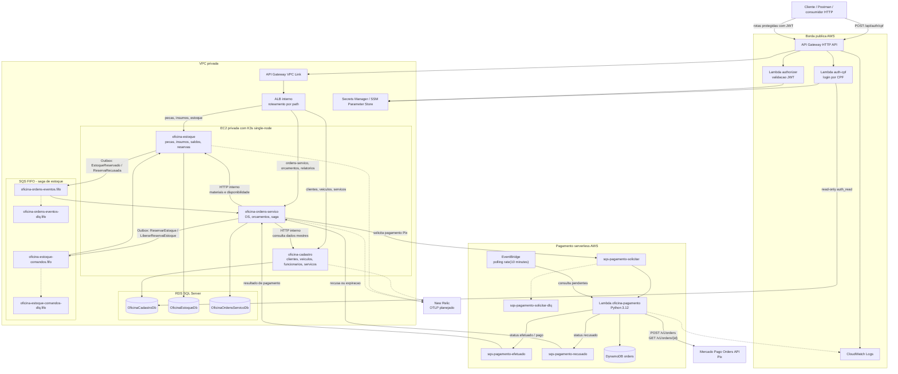

# Relatorio - Arquitetura final

## Objetivo

Descrever a arquitetura final da solucao Oficina, incluindo microsservicos,
bancos de dados, comunicacao sincrona e assincrona, seguranca de borda,
infraestrutura de execucao, pagamento Pix e observabilidade.

## Visao geral

## Componentes

| Componente | Responsabilidade |
|---|---|
| API Gateway HTTP API | Entrada publica unica, rotas explicitas, authorizer e VPC Link |
| Lambda `auth-cpf` | Login por CPF/senha e emissao de JWT |
| Lambda `authorizer` | Validacao do JWT na borda e propagacao de identidade confiavel |
| ALB interno | Roteamento privado por path para os servicos em K3s |
| Cadastro | Dono de clientes, veiculos, funcionarios e catalogo de servicos |
| Estoque | Dono de pecas, insumos, saldos, movimentacoes e reservas |
| Ordens de Servico | Dono de OS, orcamentos, status da saga, pagamento logico e relatorios |
| Pagamento | Dono da criacao e acompanhamento de orders Pix no Mercado Pago |
| RDS SQL Server | Servidor transacional com database logico por microsservico .NET |
| DynamoDB `orders` | Estado das orders Pix criadas no Mercado Pago |
| SQS FIFO da saga | Transporte confiavel entre Ordens e Estoque com ordem por OS |
| SQS de pagamento | Entrada e saida assincronas do servico serverless de Pagamento |
| EventBridge | Polling periodico das orders Pix pendentes |
| Secrets Manager / SSM | Segredos, parametros operacionais e descoberta |
| New Relic | Destino planejado para traces e metricas via OpenTelemetry |

## Comunicacao

| Tipo | Origem | Destino | Protocolo | Uso |
|---|---|---|---|---|
| Publica anonima | Cliente | API Gateway -> `auth-cpf` | HTTPS/Lambda proxy | Login por CPF |
| Publica protegida | Cliente | API Gateway -> authorizer -> ALB | HTTPS + VPC Link | Operacoes das APIs |
| Interna sincrona | Ordens | Cadastro | HTTP via ALB interno | Cliente, veiculo e servicos |
| Interna sincrona | Ordens | Estoque | HTTP via ALB interno | Materiais e disponibilidade |
| Interna assincrona | Ordens | Estoque | SQS FIFO | Reserva e liberacao de estoque |
| Interna assincrona | Estoque | Ordens | SQS FIFO | Resultado da reserva |
| Interna assincrona | Ordens | Pagamento | SQS | Criacao de order Pix |
| Interna assincrona | Pagamento | Ordens | SQS | Status `efetuado`, `pago` ou `recusado` |
| Externa | Pagamento | Mercado Pago | HTTPS | Criacao e consulta de orders Pix |
| Persistencia SQL | Servicos .NET | RDS SQL Server | TDS | Dados transacionais dos contextos |
| Persistencia NoSQL | Pagamento | DynamoDB | AWS SDK | Estado de orders Pix |
| Observabilidade | APIs/Lambda | New Relic/CloudWatch | OTLP/logs | Traces, logs e correlacao |

## Bancos de dados

O RDS SQL Server e compartilhado como servidor, mas os dados sao isolados por
database e por credenciais.

| Dono | Banco | Observacao |
|---|---|---|
| Cadastro | `OficinaCadastroDb` | Dados mestres, funcionarios e login por CPF |
| Estoque | `OficinaEstoqueDb` | Materiais, saldos, reservas, inbox/outbox |
| Ordens | `OficinaOrdensServicoDb` | OS, orcamentos, pagamentos logicos, saga, inbox/outbox |
| Pagamento | DynamoDB `orders` | Orders Pix, status Mercado Pago, status local e payload raw |

Nao ha foreign keys entre bancos de contextos diferentes. Referencias externas
sao guardadas como identificadores logicos e snapshots historicos.

## Seguranca

- A entrada publica passa por API Gateway; o ALB e interno.
- Rotas protegidas usam Lambda authorizer e cabecalhos confiaveis
  `x-oficina-user-*`.
- `auth-cpf` usa credencial somente leitura no banco de Cadastro.
- O token do Mercado Pago deve ser tratado como segredo e fornecido a Lambda
  de Pagamento via secret/variable segura.
- As DLQs preservam payloads invalidos ou mensagens com retentativas esgotadas.

## Observabilidade

A solucao usa `correlationId` nos fluxos HTTP e envelopes SQS. Para a saga,
`SagaSnapshots`, Inbox, Outbox e DLQs complementam logs estruturados. Os
servicos .NET ja estao preparados para OpenTelemetry e exportacao OTLP. A
Lambda de Pagamento registra execucoes no CloudWatch e deve propagar o
identificador da OS ou `external_reference` nas mensagens para correlacao fim a
fim.

## Limitacoes assumidas

- K3s single-node reduz custo e complexidade, mas nao oferece alta
  disponibilidade.
- No `FIAPFase4`, Ordens ainda possui pagamento mock como modo atual. A
  arquitetura final assume substituicao desse gateway por publicacao/consumo
  das filas de Pagamento.
- A Lambda de Pagamento cria e consulta orders Pix; compensacao financeira
  automatica, como estorno, deve ser evoluida por contrato especifico.
