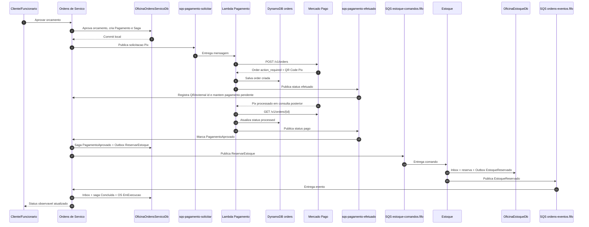
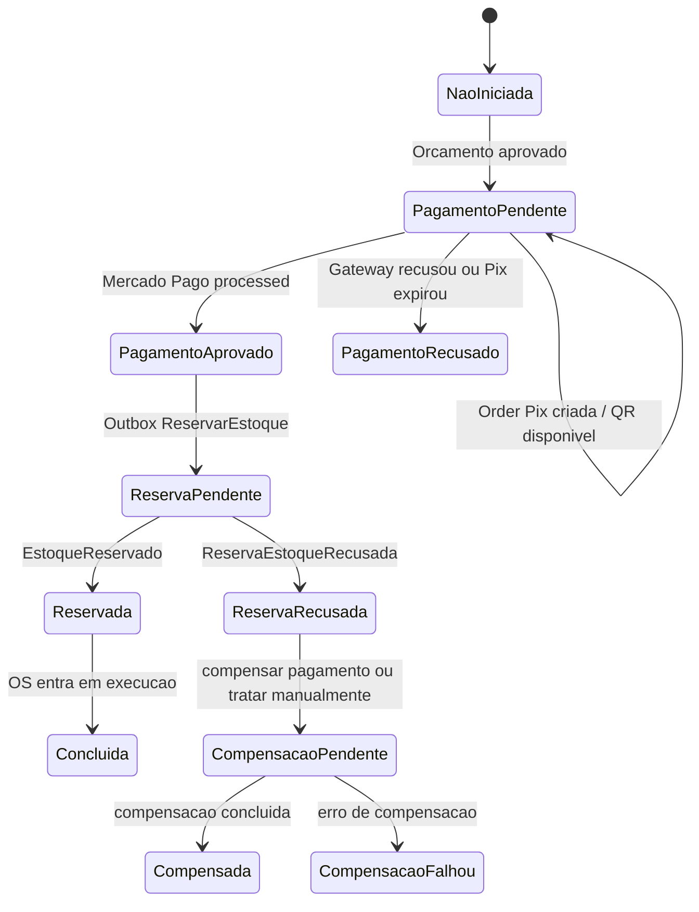

# Relatorio - Estrategia de Saga Pattern

## Decisao

A estrategia escolhida e uma **Saga coreografada por eventos, com coordenacao
local em Ordens de Servico**.

Ordens de Servico e o dono do processo de negocio da OS e guarda o estado da
saga. Estoque e Pagamento participam do fluxo por contratos assincronos:

- Estoque recebe comandos e devolve eventos por SQS FIFO.
- Pagamento recebe solicitacoes por SQS, cria/consulta orders Pix no Mercado
  Pago e devolve resultados por SQS.
- Cada participante grava seu proprio estado em seu banco.
- Nao ha transacao distribuida entre RDS, DynamoDB, Mercado Pago e filas.

Essa estrategia mantem autonomia dos microsservicos e aceita consistencia
eventual, retentativas e reentrega de mensagens.

## Papel de cada participante

| Participante | Papel na saga | Estado persistido |
|---|---|---|
| Ordens de Servico | Coordenador local e dono da OS | `SagasOrdensServico`, `SagaSnapshots`, `Pagamentos`, Outbox/Inbox |
| Pagamento | Participante serverless que cria e acompanha Pix | DynamoDB `orders` |
| Estoque | Participante que reserva/libera materiais | `ReservasEstoque`, movimentacoes, Outbox/Inbox |
| Mercado Pago | Provedor externo de pagamento Pix | Estado externo da order |

## Fluxo feliz com pagamento real

## Estados

Observacao: a mensagem `status: efetuado` representa "cobranca Pix criada",
nao "pagamento confirmado". A saga deve continuar aguardando ate o polling
identificar a order do Mercado Pago com status `processed` e a Lambda publicar
`status: pago`.

## Mensagens de pagamento

| Mensagem | Origem | Destino | Fila | Efeito |
|---|---|---|---|---|
| Solicitacao Pix | Ordens | Pagamento | `sqs-pagamento-solicitar` | Criar order no Mercado Pago |
| `status: efetuado` | Pagamento | Ordens | `sqs-pagamento-efetuado` | Informar QR Code e manter pagamento pendente |
| `status: pago` | Pagamento | Ordens | `sqs-pagamento-efetuado` | Aprovar pagamento e iniciar reserva |
| `status: recusado` | Pagamento | Ordens | `sqs-pagamento-recusado` | Encerrar ou marcar erro de pagamento |

Campos relevantes da mensagem de saida de Pagamento:

- `order_id`
- `external_reference`
- `status`
- `mercado_pago_status`
- `mercado_pago_status_detail`
- `total_amount`
- `currency`
- `pix`, quando a order e criada com sucesso
- `notified_at`

## Mensagens de estoque

| Mensagem | Origem | Destino | Fila |
|---|---|---|---|
| `ReservarEstoque` | Ordens | Estoque | `oficina-estoque-comandos.fifo` |
| `LiberarReservaEstoque` | Ordens | Estoque | `oficina-estoque-comandos.fifo` |
| `EstoqueReservado` | Estoque | Ordens | `oficina-ordens-eventos.fifo` |
| `ReservaEstoqueRecusada` | Estoque | Ordens | `oficina-ordens-eventos.fifo` |
| `ReservaEstoqueLiberada` | Estoque | Ordens | `oficina-ordens-eventos.fifo` |
| `LiberacaoReservaFalhou` | Estoque | Ordens | `oficina-ordens-eventos.fifo` |

O `ordemServicoId` e usado como `MessageGroupId` nas filas FIFO da saga de
estoque, preservando ordem por OS sem serializar todas as ordens do sistema.

## Confiabilidade

| Mecanismo | Onde fica | Motivo |
|---|---|---|
| Outbox | Ordens e Estoque | Publicar mensagem apenas depois do commit local |
| Inbox | Ordens e Estoque | Evitar duplicidade de efeito por reentrega |
| SQS FIFO | Saga Ordens/Estoque | Preservar ordem por OS |
| DLQ | Filas principais | Isolar mensagens invalidas ou com retentativas esgotadas |
| Idempotencia por chave | Pagamento | Reprocessar solicitacao sem criar order duplicada |
| DynamoDB orders | Pagamento | Manter estado local das orders e polling pendente |
| EventBridge polling | Pagamento | Confirmar Pix sem expor webhook publico |
| Saga snapshots | Ordens | Auditar cada transicao da OS |

## Por que coreografia, nao orquestracao central pura

Uma orquestracao central pura faria Ordens chamar Pagamento e Estoque de forma
imperativa, dependendo da disponibilidade imediata de todos os participantes.
Isso aumentaria acoplamento temporal e risco de timeout no fluxo de aprovacao.

Com coreografia por eventos, cada servico confirma sua propria transacao local
e o estado final converge. Ordens ainda guarda o estado da saga porque a OS
precisa expor uma situacao clara para usuarios, suporte e relatorios.

## Compensacoes

| Cenario | Acao |
|---|---|
| Pagamento recusado ou expirado antes da reserva | Ordens registra recusa e nao solicita reserva |
| Estoque recusa reserva depois de pagamento aprovado | Ordens marca `ReservaRecusada` e aciona compensacao financeira/manual |
| Reserva ja criada precisa ser liberada | Ordens publica `LiberarReservaEstoque` |
| Liberacao falha | Estoque publica `LiberacaoReservaFalhou`; Ordens marca `CompensacaoFalhou` |

A Lambda de Pagamento atual cria e consulta orders Pix. Estorno/cancelamento
automatico deve ser tratado como evolucao de contrato caso a regra de negocio
exija compensacao financeira automatizada.
