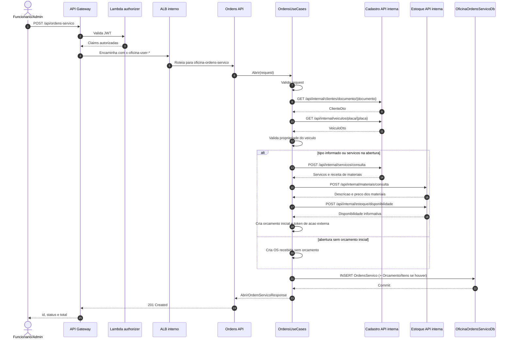

# Relatorio - Diagrama de sequencia da criacao da OS

## Escopo

Este documento descreve a sequencia da **criacao da ordem de servico** por
`POST /api/ordens-servico`.

A Saga Pattern nao inicia na criacao da OS. Ela inicia quando um orcamento e
aprovado. Na abertura, Ordens consulta Cadastro e Estoque, cria a OS e, quando
aplicavel, cria o orcamento inicial.

## Diagrama de sequencia

## Regras aplicadas

| Passo | Regra |
|---|---|
| Autorizacao | Rota exige perfil Funcionario ou Admin |
| Cliente | Documento precisa existir no Cadastro |
| Veiculo | Placa precisa existir no Cadastro |
| Ownership | Veiculo precisa pertencer ao cliente informado |
| Tipo | Tipo invalido rejeita a abertura |
| Servicos | IDs de servico sao consultados no Cadastro |
| Materiais | Pecas e insumos sao consultados no Estoque |
| Disponibilidade | Estoque responde disponibilidade para compor/validar o orcamento |
| Persistencia | OS e orcamento inicial sao salvos no banco de Ordens |
| Historico | Ordens salva snapshots de cliente e veiculo |

## Dados persistidos em Ordens

Na abertura, Ordens pode gravar:

- `OrdensServico`
- `ItensServicoOs`
- `Orcamentos`
- `OrcamentoItensServico`
- `OrcamentoItensMaterial`

Nao ha pagamento nem reserva de estoque nesse momento. Pagamento e reserva
ocorrem depois, quando o orcamento for aprovado.

## Cenarios alternativos

| Cenario | Resultado |
|---|---|
| Cliente nao encontrado | HTTP 404 com codigo de cliente inexistente |
| Veiculo nao encontrado | HTTP 404 com codigo de veiculo inexistente |
| Veiculo de outro cliente | HTTP 403 por violacao de ownership |
| Servico inexistente | HTTP 404 |
| Falha transitoria no Cadastro | Erro propagado como falha de integracao |
| Falha no Estoque | A abertura nao confirma o orcamento inicial |

## Relacao com pagamento

O microsservico de Pagamento nao participa da criacao da OS. Ele entra apenas
apos aprovacao do orcamento, quando Ordens inicia a saga e publica uma
solicitacao em `sqs-pagamento-solicitar`.
