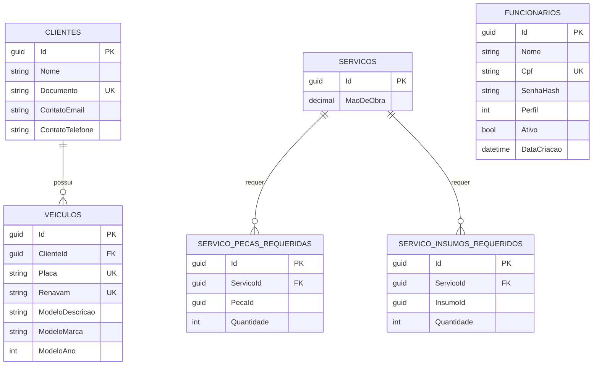
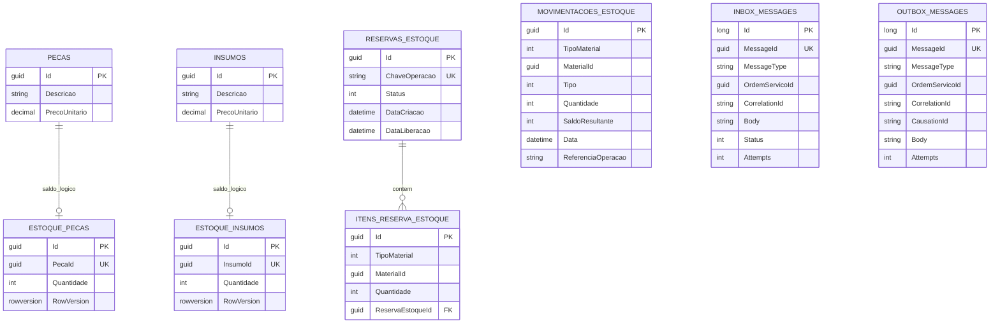
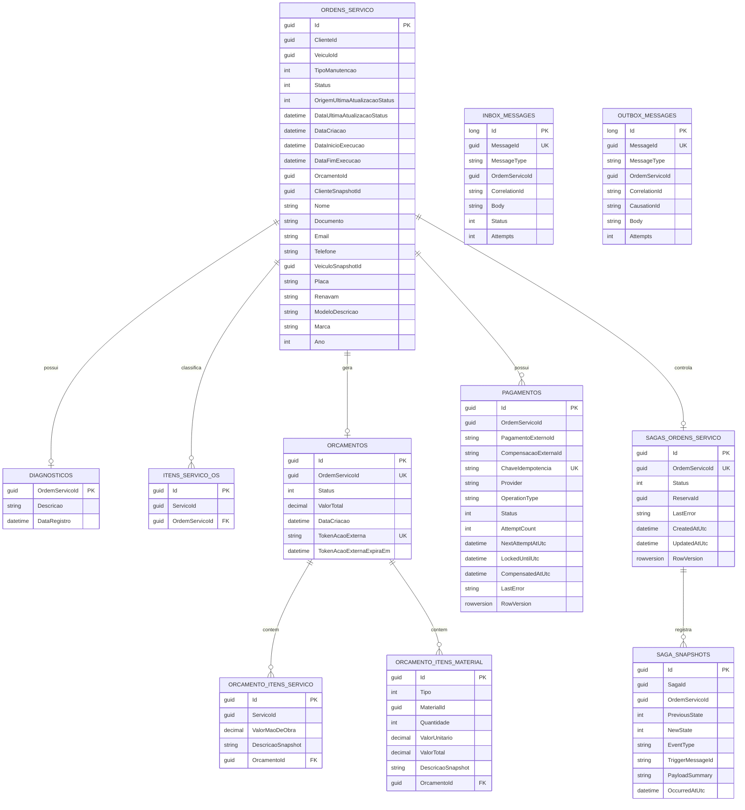
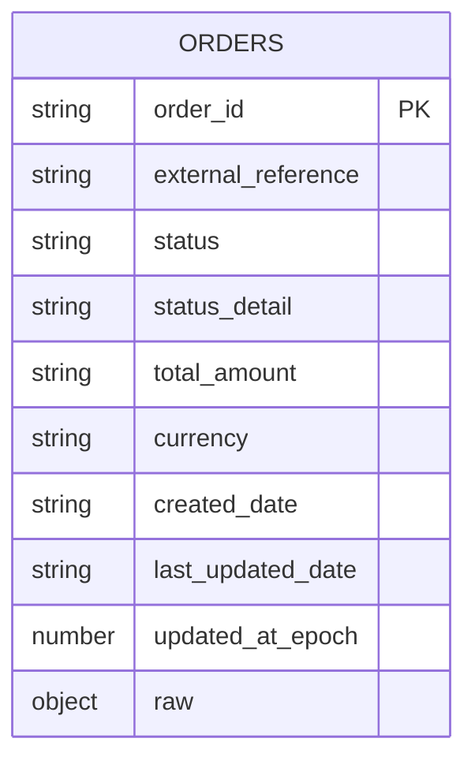

# Relatorio - Diagramas ER dos bancos de dados

## Visao geral

A solucao usa persistencia poliglota:

- RDS SQL Server para Cadastro, Estoque e Ordens.
- DynamoDB para o estado das orders Pix do servico de Pagamento.

Nao ha foreign keys entre databases de contextos diferentes. Referencias entre
contextos sao logicas, por identificadores e snapshots.

## Cadastro - `OficinaCadastroDb`

Observacoes:

- `Funcionario` e usado pela autenticacao por CPF.
- `PecaId` e `InsumoId` apontam logicamente para materiais do Estoque, sem FK
  fisica entre databases.

## Estoque - `OficinaEstoqueDb`

Observacoes:

- `MovimentacoesEstoque` e append-only.
- `MaterialId` e polimorfico: representa peca ou insumo conforme
  `TipoMaterial`.
- Inbox e Outbox pertencem ao mecanismo de mensageria da saga.

## Ordens - `OficinaOrdensServicoDb`

Observacoes:

- `ClienteId`, `VeiculoId`, `ServicoId` e `MaterialId` sao referencias logicas
  a outros contextos.
- Snapshots preservam historico da OS mesmo que cadastro ou estoque mudem.
- `SagasOrdensServico` guarda o estado atual; `SagaSnapshots` guarda auditoria.

## Pagamento - DynamoDB `orders`

DynamoDB nao e relacional, mas a tabela possui um agregado principal por
`order_id`.

Campos principais:

| Campo | Uso |
|---|---|
| `order_id` | Chave da order no Mercado Pago ou `external_reference` em recusa antes de criar order |
| `external_reference` | Referencia da OS/pedido usada para idempotencia |
| `status` | Status nativo do Mercado Pago ou status interno `recusado` |
| `status_detail` | Detalhe do provider ou motivo local |
| `raw` | Payload bruto retornado pelo Mercado Pago |
| `updated_at_epoch` | Suporte a ordenacao, auditoria e possivel TTL/consulta operacional |

O repositorio atual faz `scan` para localizar orders nao terminais no polling.
Caso o volume cresca, a evolucao natural e criar um GSI por `status`.
