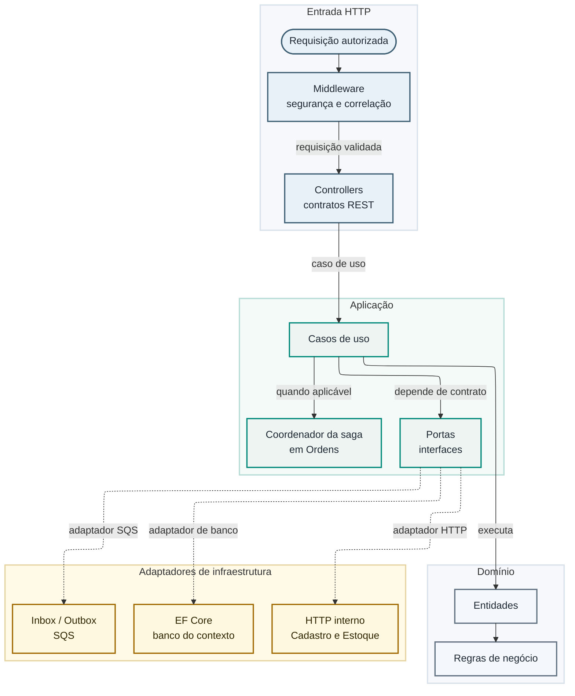
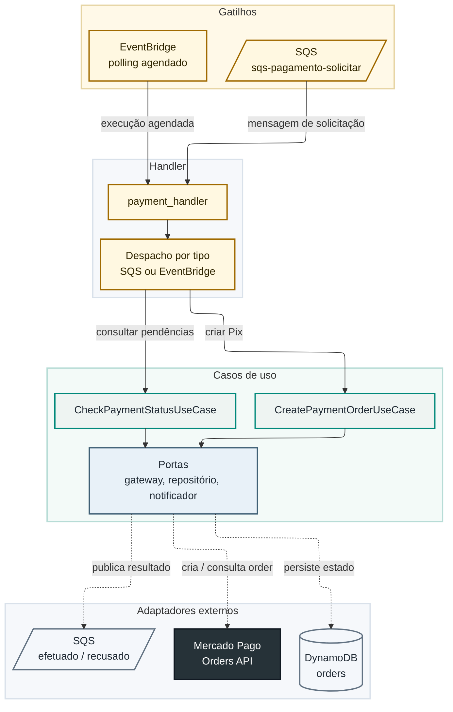

# Componentes

Esta página detalha a organização interna dos serviços, complementando a
[visão geral](visao-geral.md), que mostra a topologia entre eles.

## Diagrama de componentes dos serviços .NET

Cadastro, Estoque e Ordens de Serviço seguem a mesma organização em camadas:
API expõe os endpoints, a aplicação orquestra casos de uso por trás de portas
(interfaces), o domínio concentra as regras de negócio e a infraestrutura
implementa as portas — persistência com EF Core, clientes HTTP tipados para
integração interna e mensageria com Inbox/Outbox sobre SQS.

Em **Ordens de Serviço**, a camada de aplicação inclui também o coordenador
da saga: ele decide quando publicar um comando, interpreta as respostas
recebidas por mensageria e atualiza o estado persistido da OS.

## Diagrama de componentes da Lambda de Pagamento

`oficina-pagamento` segue arquitetura hexagonal (portas e adaptadores) em
Python. Um único handler despacha para o caso de uso certo conforme a origem
do evento: mensagem SQS ou execução agendada do EventBridge.

O domínio (validação do payload, entidades `Order` e `OrderRequest`) não
depende de SDK de nuvem nem de bibliotecas HTTP — apenas as portas conhecem
essas interfaces, e apenas os adaptadores implementam a comunicação real com
Mercado Pago, DynamoDB e SQS.
