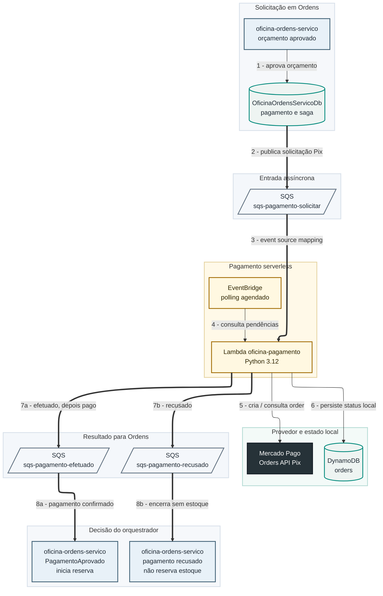

# Comunicação e integração

Esta página concentra os contratos de comunicação entre os serviços. Detalhes
de decisão ficam em [Decisões → RFCs](../decisoes/rfcs.md).

## Comunicação entre os serviços

| Tipo | Origem | Destino | Protocolo | Uso |
|---|---|---|---|---|
| Pública anônima | Cliente | API Gateway → `auth-cpf` | HTTPS / Lambda proxy | Login por CPF |
| Pública protegida | Cliente | API Gateway → authorizer → ALB | HTTPS + VPC Link | Operações das APIs |
| Interna síncrona | Ordens | Cadastro | HTTP via ALB interno | Cliente, veículo e serviços |
| Interna síncrona | Ordens | Estoque | HTTP via ALB interno | Materiais e disponibilidade |
| Interna assíncrona | Ordens | Estoque | SQS FIFO | Reserva e liberação de estoque |
| Interna assíncrona | Estoque | Ordens | SQS FIFO | Resultado da reserva |
| Interna assíncrona | Ordens | Pagamento | SQS | Criação de order Pix |
| Interna assíncrona | Pagamento | Ordens | SQS | Status `efetuado`, `pago` ou `recusado` |
| Externa | Pagamento | Mercado Pago | HTTPS | Criação e consulta de orders Pix |
| Persistência SQL | Serviços .NET | RDS SQL Server | TDS | Dados transacionais dos contextos |
| Persistência NoSQL | Pagamento | DynamoDB | AWS SDK | Estado das orders Pix |

## Diagrama de comunicação da saga de estoque

Disparada quando o orçamento é aprovado e o pagamento é confirmado.

```mermaid
---
config:
  layout: elk
---
flowchart TB
    subgraph ORIGEM["Orquestração em Ordens"]
        direction LR
        Ordens["oficina-ordens-servico<br/>pagamento aprovado"]
        OrdensOutbox[("OficinaOrdensServicoDb<br/>Outbox")]
    end

    subgraph COMANDO["Comando para Estoque"]
        direction LR
        Comandos[/"SQS FIFO<br/>oficina-estoque-comandos.fifo"/]
    end

    subgraph ESTOQUE_LANE["Execução em Estoque"]
        direction LR
        Estoque["oficina-estoque<br/>reserva materiais"]
        EstoqueDb[("OficinaEstoqueDb<br/>Inbox + reserva + Outbox")]
    end

    subgraph EVENTO["Evento para Ordens"]
        direction LR
        Eventos[/"SQS FIFO<br/>oficina-ordens-eventos.fifo"/]
    end

    subgraph RETORNO["Conclusão da saga"]
        direction LR
        OrdensFim["oficina-ordens-servico<br/>saga concluída<br/>OS em execução"]
        OrdensInbox[("OficinaOrdensServicoDb<br/>Inbox + status da OS")]
    end

    Ordens -->|"1 - grava transição local"| OrdensOutbox
    OrdensOutbox ==>|"2 - publica ReservarEstoque<br/>MessageGroupId = ordemServicoId"| Comandos
    Comandos ==>|"3 - entrega comando"| Estoque
    Estoque -->|"4 - aplica reserva"| EstoqueDb
    EstoqueDb ==>|"5 - publica EstoqueReservado"| Eventos
    Eventos ==>|"6 - entrega evento"| OrdensFim
    OrdensFim -->|"7 - registra conclusão"| OrdensInbox

    classDef app fill:#E8F1F8,stroke:#3F6075,stroke-width:2px,color:#1F2933
    classDef banco fill:#EEF4F2,stroke:#00897B,stroke-width:2px,color:#1F2933
    classDef fila fill:#F4F7FB,stroke:#627282,stroke-width:2px,color:#1F2933

    class Ordens,Estoque,OrdensFim app
    class OrdensOutbox,EstoqueDb,OrdensInbox banco
    class Comandos,Eventos fila

    style ORIGEM fill:#F6F8FB,stroke:#D9E1EA,stroke-width:2px
    style COMANDO fill:#F4F7FB,stroke:#D9E1EA,stroke-width:2px
    style ESTOQUE_LANE fill:#F3FAF8,stroke:#B7DCD6,stroke-width:2px
    style EVENTO fill:#F4F7FB,stroke:#D9E1EA,stroke-width:2px
    style RETORNO fill:#F6F8FB,stroke:#D9E1EA,stroke-width:2px
```

## Diagrama de comunicação do pagamento Pix

`oficina-ordens-servico` aparece nas duas pontas do fluxo: publica a
solicitação quando o orçamento é aprovado e consome o resultado quando o
Pix é confirmado.

!!! note "Sobre o status `efetuado`"

    O status `efetuado` significa "cobrança Pix criada", não "pagamento
    confirmado". A saga permanece aguardando até o polling identificar a order
    como processada no Mercado Pago e publicar o status `pago`.

## Contratos de mensagem

Toda mensagem da saga de estoque usa um envelope comum:

| Campo | Descrição |
|---|---|
| `messageId` | Identificador único da mensagem, usado na deduplicação FIFO |
| `messageType` | Nome do comando ou evento |
| `schemaVersion` | Versão do contrato |
| `occurredAtUtc` | Instante de geração da mensagem |
| `correlationId` | Identificador para rastrear o fluxo fim a fim |
| `causationId` | Mensagem que originou esta, quando aplicável |
| `ordemServicoId` | Chave de negócio e `MessageGroupId` da fila FIFO |
| `payload` | Corpo específico do tipo de mensagem |

### Filas e mensagens

| Fila | Produtor | Consumidor | Mensagens |
|---|---|---|---|
| `oficina-estoque-comandos.fifo` | Ordens | Estoque | `ReservarEstoque`, `LiberarReservaEstoque` |
| `oficina-ordens-eventos.fifo` | Estoque | Ordens | `EstoqueReservado`, `ReservaEstoqueRecusada`, `ReservaEstoqueLiberada`, `LiberacaoReservaFalhou` |
| `sqs-pagamento-solicitar` | Ordens | Pagamento | Solicitação de criação de Pix |
| `sqs-pagamento-efetuado` | Pagamento | Ordens | Status `efetuado` e `pago` |
| `sqs-pagamento-recusado` | Pagamento | Ordens | Status `recusado` |

Cada fila principal da saga de estoque tem uma DLQ associada, para isolar
mensagens inválidas ou com retentativas esgotadas.
