# Visão geral

Esta página apresenta a topologia principal da solução Oficina: borda pública,
rede privada, microsserviços, bancos, mensageria e pagamento Pix.

## Diagrama geral da arquitetura

O diagrama segue a topologia do Diagrama 1 de `docs/diagrama-arquitetura.md`:
primeiro o caminho síncrono do cliente até os serviços e bancos, depois o fluxo
assíncrono. A parte de pagamento foi expandida com filas, Lambda, DynamoDB,
EventBridge e Mercado Pago. Para manter as setas coesas, `oficina-ordens-servico`
e `oficina-estoque` aparecem novamente na faixa assíncrona como pontos do mesmo
serviço em momentos diferentes do fluxo.

```mermaid
---
config:
  layout: elk
---
flowchart TB
    Cliente(["Cliente / Funcionário"])

    subgraph EDGE["Borda pública AWS"]
        direction LR
        ApiGw["API Gateway<br/>HTTP API"]
        AuthCpf["Lambda auth-cpf<br/>login CPF/senha"]
        Authz["Lambda authorizer<br/>validação JWT"]
    end

    subgraph NET["Rede privada"]
        direction LR
        VpcLink["VPC Link"]
        ALB["ALB interno<br/>roteamento por path"]
    end

    subgraph K3S["K3s - EC2 privada"]
        direction LR
        Cadastro["oficina-cadastro"]
        OrdensApi["oficina-ordens-servico<br/>API e coordenador da saga"]
        EstoqueApi["oficina-estoque"]
    end

    subgraph SQLDB["RDS SQL Server"]
        direction LR
        CadastroDb[("OficinaCadastroDb")]
        OrdensDb[("OficinaOrdensServicoDb")]
        EstoqueDb[("OficinaEstoqueDb")]
    end

    subgraph PAGAMENTO["Pagamento Pix serverless"]
        direction LR
        Solicitar[/"SQS<br/>sqs-pagamento-solicitar"/]
        PayTimer["EventBridge<br/>polling agendado"]
        PayLambda["Lambda oficina-pagamento<br/>Python 3.12"]
        MP["Mercado Pago<br/>Orders API Pix"]
        PayDb[("DynamoDB<br/>orders")]
        Efetuado[/"SQS<br/>sqs-pagamento-efetuado"/]
        Recusado[/"SQS<br/>sqs-pagamento-recusado"/]
    end

    subgraph POSPAGAMENTO["Continuação da saga após pagamento"]
        direction LR
        OrdensPagamento["oficina-ordens-servico<br/>consome status do pagamento"]
        OrdensRecusa["oficina-ordens-servico<br/>pagamento recusado ou expirado"]
        ComandosEstoque[/"SQS FIFO<br/>oficina-estoque-comandos.fifo"/]
        EstoqueSaga["oficina-estoque<br/>reserva ou libera materiais"]
        EventosOrdens[/"SQS FIFO<br/>oficina-ordens-eventos.fifo"/]
        OrdensFim["oficina-ordens-servico<br/>OS em execução ou compensada"]
    end

    Cliente -->|"1 - login e operações REST"| ApiGw
    ApiGw -->|"1a - emite JWT"| AuthCpf
    ApiGw -->|"1b - valida JWT"| Authz
    ApiGw -->|"2 - tráfego autorizado"| VpcLink
    VpcLink --> ALB

    ALB -->|"3 - rotas /cadastro"| Cadastro
    ALB -->|"3 - rotas /ordens"| OrdensApi
    ALB -->|"3 - rotas /estoque"| EstoqueApi

    OrdensApi -->|"4 - clientes, veículos e serviços"| Cadastro
    OrdensApi -->|"4 - materiais e disponibilidade"| EstoqueApi

    Cadastro --> CadastroDb
    OrdensApi --> OrdensDb
    EstoqueApi --> EstoqueDb

    OrdensApi ==>|"5 - orçamento aprovado solicita Pix"| Solicitar
    Solicitar ==>|"6 - entrega assíncrona"| PayLambda
    PayTimer -->|"7 - consulta pendências"| PayLambda
    PayLambda -->|"8 - cria e consulta order"| MP
    PayLambda -->|"9 - idempotência e status local"| PayDb
    PayLambda ==>|"10a - QR criado ou pagamento confirmado"| Efetuado
    PayLambda ==>|"10b - pagamento recusado ou erro final"| Recusado

    Efetuado ==>|"11a - efetuado, depois pago"| OrdensPagamento
    Recusado ==>|"11b - encerra sem reservar estoque"| OrdensRecusa
    OrdensPagamento ==>|"12 - se pago, ReservarEstoque"| ComandosEstoque
    ComandosEstoque ==>|"13 - comando por ordemServicoId"| EstoqueSaga
    EstoqueSaga -->|"14 - reserva / movimentação"| EstoqueDb
    EstoqueSaga ==>|"15 - EstoqueReservado ou recusa"| EventosOrdens
    EventosOrdens ==>|"16 - atualiza saga e OS"| OrdensFim
    OrdensFim -->|"17 - persiste transição final"| OrdensDb

    classDef ator fill:#E8F1F8,stroke:#3F6075,stroke-width:2px,color:#1F2933
    classDef borda fill:#FFF8E1,stroke:#A06A00,stroke-width:2px,color:#2F2500
    classDef rede fill:#EEF4F2,stroke:#00897B,stroke-width:2px,color:#1F2933
    classDef app fill:#E8F1F8,stroke:#3F6075,stroke-width:2px,color:#1F2933
    classDef banco fill:#EEF4F2,stroke:#00897B,stroke-width:2px,color:#1F2933
    classDef fila fill:#F4F7FB,stroke:#627282,stroke-width:2px,color:#1F2933
    classDef lambda fill:#FFF8E1,stroke:#A06A00,stroke-width:2px,color:#2F2500
    classDef externo fill:#263238,stroke:#111922,stroke-width:2px,color:#ffffff

    class Cliente ator
    class ApiGw,AuthCpf,Authz borda
    class VpcLink,ALB rede
    class Cadastro,OrdensApi,EstoqueApi,OrdensPagamento,OrdensRecusa,EstoqueSaga,OrdensFim app
    class CadastroDb,OrdensDb,EstoqueDb,PayDb banco
    class Solicitar,Efetuado,Recusado,ComandosEstoque,EventosOrdens fila
    class PayLambda,PayTimer lambda
    class MP externo

    style EDGE fill:#FFF9E8,stroke:#E6D4A3,stroke-width:2px
    style NET fill:#F3FAF8,stroke:#B7DCD6,stroke-width:2px
    style K3S fill:#F6F8FB,stroke:#D9E1EA,stroke-width:2px
    style SQLDB fill:#F3FAF8,stroke:#B7DCD6,stroke-width:2px
    style PAGAMENTO fill:#FFF9E8,stroke:#E6D4A3,stroke-width:2px
    style POSPAGAMENTO fill:#F6F8FB,stroke:#D9E1EA,stroke-width:2px
```

## Componentes

| Componente | Responsabilidade |
|---|---|
| API Gateway HTTP API | Entrada pública única, rotas explícitas, authorizer e VPC Link |
| Lambda `auth-cpf` | Login por CPF/senha e emissão do JWT |
| Lambda `authorizer` | Validação do JWT na borda e propagação de identidade confiável |
| ALB interno | Roteamento privado por path para os serviços em K3s |
| Cadastro | Dono de clientes, veículos, funcionários e catálogo de serviços |
| Estoque | Dono de peças, insumos, saldos, movimentações e reservas |
| Ordens de Serviço | Dono da OS, orçamentos, coordenação da saga e relatórios |
| Pagamento | Criação e acompanhamento de orders Pix no Mercado Pago |
| RDS SQL Server | Servidor transacional, com um banco lógico por microsserviço .NET |
| DynamoDB `orders` | Estado das orders Pix criadas no Mercado Pago |
| SQS FIFO da saga | Transporte confiável entre Ordens e Estoque, com ordem por OS |
| SQS de pagamento | Entrada e saída assíncronas do serviço de Pagamento |
| EventBridge | Agenda o polling periódico das orders Pix pendentes |
| OpenTelemetry / New Relic | Traces e métricas dos serviços .NET |

## Segurança

A entrada pública passa pelo API Gateway; o ALB é interno e não recebe
tráfego direto da internet. Rotas protegidas exigem JWT validado pelo Lambda
`authorizer`, que propaga a identidade autenticada aos microsserviços por
cabeçalhos confiáveis. O login por CPF usa uma credencial de banco somente
leitura, dedicada e distinta da credencial de runtime dos serviços. Segredos
operacionais — credenciais de banco, token do provedor de pagamento — ficam
em Secrets Manager e Parameter Store, nunca em código ou configuração
versionada.

## Observabilidade

A solução propaga um `correlationId` pelos fluxos HTTP e pelos envelopes de
mensageria. Os serviços .NET são instrumentados com OpenTelemetry e exportam
para um coletor compartilhado, com exportação **fail-open**: falha no
exportador não derruba a aplicação. `SagaSnapshots`, Inbox, Outbox e DLQs
complementam os logs estruturados para investigar falhas distribuídas.
