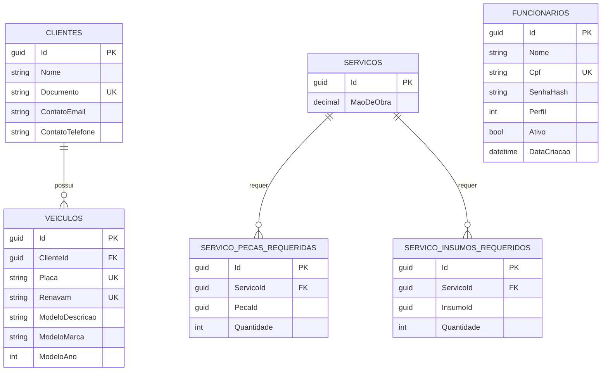
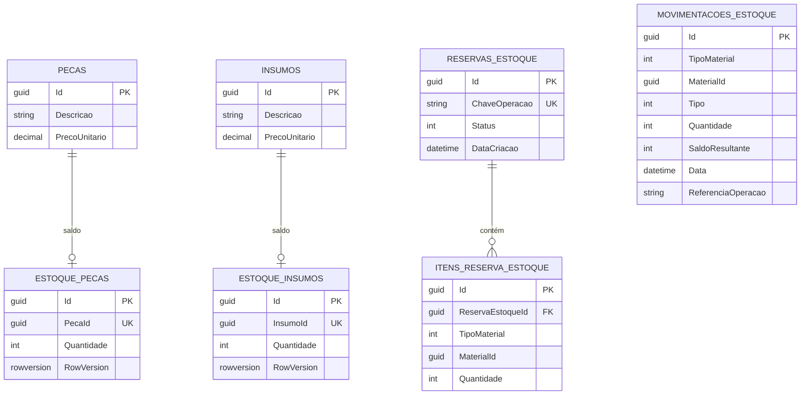
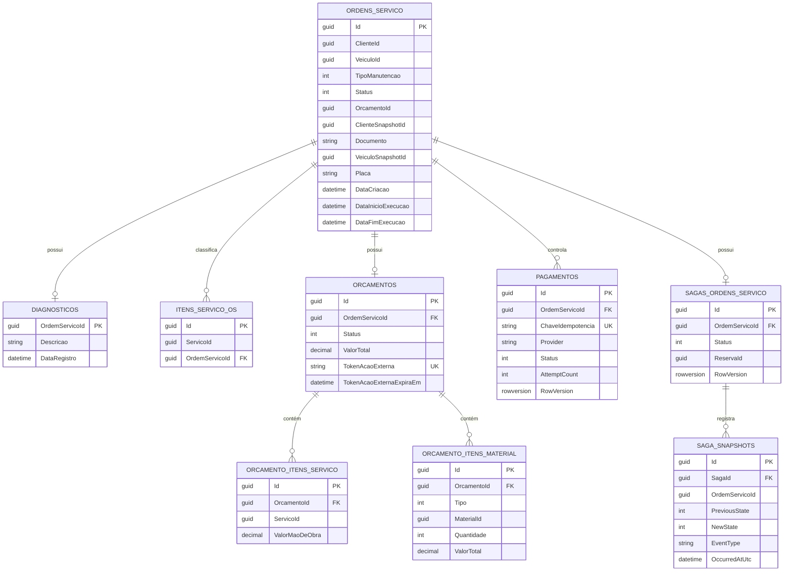
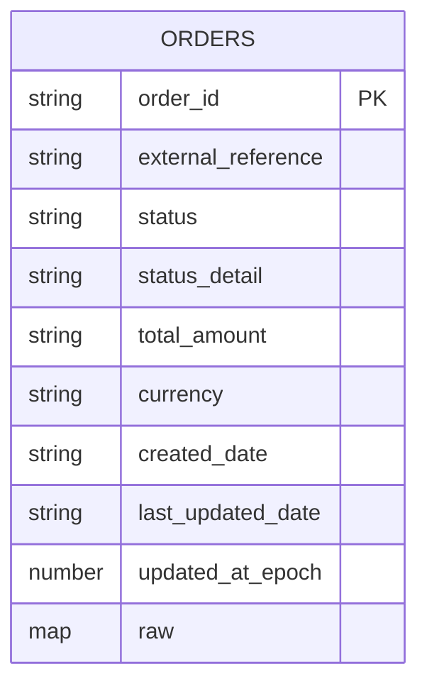

# Bancos de dados

## Visão geral

A solução usa persistência poliglota: RDS SQL Server para Cadastro, Estoque
e Ordens de Serviço, e DynamoDB para o estado das orders Pix do serviço de
Pagamento.

Não há foreign keys entre bancos de contextos diferentes. Referências entre
contextos são lógicas, por identificador, e Ordens preserva snapshots de
cliente e veículo para manter histórico mesmo que o Cadastro mude.

## Modelo de dados do Cadastro — `OficinaCadastroDb`

`Funcionarios` é consultado pela autenticação por CPF. `PecaId` e `InsumoId`
apontam logicamente para materiais do Estoque, sem FK física entre bancos.

## Modelo de dados do Estoque — `OficinaEstoqueDb`

`MovimentacoesEstoque` é append-only: o banco rejeita alteração ou remoção
de linhas existentes. `MaterialId` é polimórfico — representa peça ou
insumo conforme `TipoMaterial` — por isso não tem FK física.

## Modelo de dados de Ordens de Serviço — `OficinaOrdensServicoDb`

`ClienteId`, `VeiculoId`, `ServicoId` e `MaterialId` são referências lógicas
a outros contextos. Snapshots preservam o histórico da OS mesmo que Cadastro
ou Estoque mudem. `OrdensServico.OrcamentoId` aponta para o orçamento
vigente por identificador — não é FK física, para não criar dependência
circular com `Orcamentos.OrdemServicoId`. `SagasOrdensServico` guarda o
estado atual da saga; `SagaSnapshots` guarda a auditoria de cada transição.
Inbox e Outbox seguem o mesmo mecanismo de mensageria descrito em
[Comunicação e integração](../arquitetura/comunicacao-integracao.md), sem
relação de FK com as tabelas de domínio.

## Modelo de dados de Pagamento — DynamoDB `orders`

DynamoDB não é relacional, mas a tabela tem um agregado principal por
`order_id`.

| Campo | Uso |
|---|---|
| `order_id` | Chave da order no Mercado Pago, ou o `external_reference` quando a order é recusada antes de ser criada |
| `external_reference` | Referência da OS, usada para idempotência |
| `status` | Status nativo do Mercado Pago, ou o status interno `recusado` |
| `status_detail` | Detalhe do provedor ou motivo local |
| `raw` | Payload bruto retornado pelo Mercado Pago |
| `updated_at_epoch` | Suporte a ordenação e auditoria |

O acesso a orders pendentes hoje usa varredura por atributo `status`. Caso o
volume cresça, a evolução natural é criar um índice secundário por `status`.
