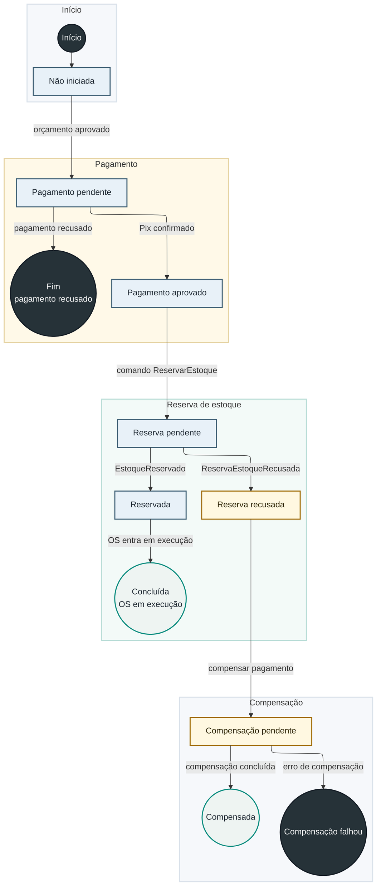

# Saga Pattern

## Estratégia de Saga

A estratégia escolhida é uma **Saga orquestrada, com o orquestrador
embarcado em Ordens de Serviço**.

Ordens de Serviço é dona do processo de negócio da OS e guarda o estado da
saga. Ela decide explicitamente cada próximo passo e envia **comandos**
assíncronos aos demais participantes:

- Estoque recebe comandos (`ReservarEstoque`, `LiberarReservaEstoque`) e
  devolve eventos de resultado por SQS FIFO — ele não decide o que fazer a
  seguir na saga, apenas executa o comando e responde.
- Pagamento recebe uma solicitação por SQS, cria e acompanha a order Pix no
  Mercado Pago, e devolve o resultado por SQS — também sem decidir o próximo
  passo do processo.
- Cada participante grava seu próprio estado em seu banco; não há transação
  distribuída entre RDS, DynamoDB, Mercado Pago e filas.

## Justificativa da orquestração

Em uma coreografia pura, cada serviço reage a eventos de domínio publicados
de forma independente, sem um dono único da sequência. Não é o que o código
implementa: o coordenador em Ordens mantém a máquina de estados da saga,
decide quando publicar cada comando e interpreta as respostas recebidas —
Estoque e Pagamento não tomam decisão de roteamento, apenas executam o que
foi solicitado e respondem.

Orquestração com um coordenador embarcado (em vez de um orquestrador central
separado) mantém a autonomia de dados de cada participante e evita
transação distribuída, ao mesmo tempo em que dá à OS uma fonte única e clara
de estado — necessária para expor situação a usuários, suporte e relatórios.
O custo é que Ordens concentra a lógica de coordenação e se torna uma
dependência para o avanço da saga; Outbox, Inbox e os snapshots de auditoria
existem justamente para tornar essa concentração confiável e rastreável.

## Papel de cada participante

| Participante | Papel na saga | Estado persistido |
|---|---|---|
| Ordens de Serviço | Orquestrador e dono da OS | `SagasOrdensServico`, `SagaSnapshots`, `Pagamentos`, Outbox/Inbox |
| Pagamento | Participante que cria e acompanha o Pix | DynamoDB `orders` |
| Estoque | Participante que reserva/libera materiais | `ReservasEstoque`, movimentações, Outbox/Inbox |
| Mercado Pago | Provedor externo de pagamento Pix | Estado externo da order |

## Fluxo fim a fim da Saga

O fluxo completo é um ciclo: Ordens aciona o pagamento e, mais tarde, recebe o
resultado de volta; o mesmo acontece com a reserva de estoque. Um único
diagrama com os dois ciclos obrigaria o diagrama a voltar sobre si mesmo. Por
legibilidade, o fluxo é separado em dois diagramas de propósito único — a
mesma razão que separa
[a saga de estoque do pagamento Pix](../arquitetura/comunicacao-integracao.md)
na página de comunicação e integração.

### Parte 1 — Aprovação do orçamento e pagamento Pix

```mermaid
---
config:
  layout: elk
---
flowchart TB
    subgraph APROVACAO["Aprovação em Ordens"]
        direction LR
        Cliente(["Cliente / Funcionário"])
        Ordens["Ordens de Serviço<br/>aprova orçamento"]
        OrdensDb[("OficinaOrdensServicoDb<br/>Pagamento + Saga")]
    end

    subgraph SOLICITACAO["Solicitação Pix"]
        direction LR
        PayIn[/"SQS<br/>sqs-pagamento-solicitar"/]
        PagamentoCriacao["Lambda Pagamento<br/>criação da order"]
    end

    subgraph ORDER_PIX["Order no Mercado Pago"]
        direction LR
        MPCreate["Mercado Pago<br/>cria order Pix"]
        PayDbCriacao[("DynamoDB orders<br/>order pendente")]
        PayOkEfetuado[/"SQS<br/>sqs-pagamento-efetuado"/]
        OrdensPendente["Ordens de Serviço<br/>registra QR<br/>PagamentoPendente"]
    end

    subgraph POLLING["Confirmação posterior"]
        direction LR
        Timer["EventBridge<br/>polling agendado"]
        PagamentoPolling["Lambda Pagamento<br/>consulta pendências"]
        MPConsulta["Mercado Pago<br/>consulta order"]
        PayDbPago[("DynamoDB orders<br/>status processado")]
        PayOkPago[/"SQS<br/>sqs-pagamento-efetuado"/]
        OrdensAprovado["Ordens de Serviço<br/>PagamentoAprovado"]
    end

    Cliente -->|"1 - aprovar orçamento"| Ordens
    Ordens -->|"2 - transação local"| OrdensDb
    OrdensDb ==>|"3 - publica solicitação Pix"| PayIn
    PayIn ==>|"4 - entrega mensagem"| PagamentoCriacao
    PagamentoCriacao -->|"5 - POST /orders"| MPCreate
    MPCreate -->|"6 - QR Code Pix"| PayDbCriacao
    PayDbCriacao ==>|"7 - status efetuado"| PayOkEfetuado
    PayOkEfetuado ==>|"8 - pagamento ainda pendente"| OrdensPendente
    OrdensPendente -->|"9 - aguarda Pix processado"| Timer
    Timer -->|"10 - dispara polling"| PagamentoPolling
    PagamentoPolling -->|"11 - GET /orders/{id}"| MPConsulta
    MPConsulta -->|"12 - status processed"| PayDbPago
    PayDbPago ==>|"13 - status pago"| PayOkPago
    PayOkPago ==>|"14 - aprova pagamento na saga"| OrdensAprovado

    classDef ator fill:#E8F1F8,stroke:#3F6075,stroke-width:2px,color:#1F2933
    classDef app fill:#E8F1F8,stroke:#3F6075,stroke-width:2px,color:#1F2933
    classDef banco fill:#EEF4F2,stroke:#00897B,stroke-width:2px,color:#1F2933
    classDef fila fill:#F4F7FB,stroke:#627282,stroke-width:2px,color:#1F2933
    classDef lambda fill:#FFF8E1,stroke:#A06A00,stroke-width:2px,color:#2F2500
    classDef externo fill:#263238,stroke:#111922,stroke-width:2px,color:#ffffff

    class Cliente ator
    class Ordens,OrdensPendente,OrdensAprovado app
    class OrdensDb,PayDbCriacao,PayDbPago banco
    class PayIn,PayOkEfetuado,PayOkPago fila
    class PagamentoCriacao,Timer,PagamentoPolling lambda
    class MPCreate,MPConsulta externo

    style APROVACAO fill:#F6F8FB,stroke:#D9E1EA,stroke-width:2px
    style SOLICITACAO fill:#F4F7FB,stroke:#D9E1EA,stroke-width:2px
    style ORDER_PIX fill:#FFF9E8,stroke:#E6D4A3,stroke-width:2px
    style POLLING fill:#F3FAF8,stroke:#B7DCD6,stroke-width:2px
```

O status `efetuado` significa "cobrança Pix criada", não "pagamento
confirmado". A saga permanece em `PagamentoPendente` até o polling
identificar a order como processada e a Lambda publicar o status `pago`.

### Parte 2 — Reserva de estoque

Disparada assim que a Parte 1 termina com `PagamentoAprovado`.

```mermaid
---
config:
  layout: elk
---
flowchart TB
    subgraph ORDENS_INICIO["Ordens publica comando"]
        direction LR
        Ordens["Ordens de Serviço<br/>PagamentoAprovado"]
        OrdensDbOutbox[("OficinaOrdensServicoDb<br/>Outbox ReservarEstoque")]
    end

    subgraph CMD_ESTOQUE["Fila de comando"]
        direction LR
        Cmd[/"SQS FIFO<br/>oficina-estoque-comandos.fifo"/]
    end

    subgraph EXECUCAO_ESTOQUE["Estoque executa reserva"]
        direction LR
        Estoque["Estoque<br/>processa comando"]
        EstoqueDb[("OficinaEstoqueDb<br/>Inbox + reserva + Outbox")]
    end

    subgraph EVT_ORDENS["Fila de evento"]
        direction LR
        Ev[/"SQS FIFO<br/>oficina-ordens-eventos.fifo"/]
    end

    subgraph ORDENS_FIM["Ordens conclui a saga"]
        direction LR
        OrdensFim["Ordens de Serviço<br/>saga concluída"]
        OrdensDbInbox[("OficinaOrdensServicoDb<br/>Inbox + OS em execução")]
        Cliente(["Cliente / Funcionário<br/>status observável atualizado"])
    end

    Ordens -->|"1 - grava transição local"| OrdensDbOutbox
    OrdensDbOutbox ==>|"2 - publica ReservarEstoque"| Cmd
    Cmd ==>|"3 - entrega comando"| Estoque
    Estoque -->|"4 - reserva materiais"| EstoqueDb
    EstoqueDb ==>|"5 - publica EstoqueReservado"| Ev
    Ev ==>|"6 - entrega evento"| OrdensFim
    OrdensFim -->|"7 - registra conclusão"| OrdensDbInbox
    OrdensDbInbox -->|"8 - status disponível"| Cliente

    classDef ator fill:#E8F1F8,stroke:#3F6075,stroke-width:2px,color:#1F2933
    classDef app fill:#E8F1F8,stroke:#3F6075,stroke-width:2px,color:#1F2933
    classDef banco fill:#EEF4F2,stroke:#00897B,stroke-width:2px,color:#1F2933
    classDef fila fill:#F4F7FB,stroke:#627282,stroke-width:2px,color:#1F2933

    class Cliente ator
    class Ordens,Estoque,OrdensFim app
    class OrdensDbOutbox,EstoqueDb,OrdensDbInbox banco
    class Cmd,Ev fila

    style ORDENS_INICIO fill:#F6F8FB,stroke:#D9E1EA,stroke-width:2px
    style CMD_ESTOQUE fill:#F4F7FB,stroke:#D9E1EA,stroke-width:2px
    style EXECUCAO_ESTOQUE fill:#F3FAF8,stroke:#B7DCD6,stroke-width:2px
    style EVT_ORDENS fill:#F4F7FB,stroke:#D9E1EA,stroke-width:2px
    style ORDENS_FIM fill:#F6F8FB,stroke:#D9E1EA,stroke-width:2px
```

## Estados da Saga

## Mensagens de pagamento

| Mensagem | Origem | Destino | Fila | Efeito |
|---|---|---|---|---|
| Solicitação Pix | Ordens | Pagamento | `sqs-pagamento-solicitar` | Cria a order no Mercado Pago |
| Status `efetuado` | Pagamento | Ordens | `sqs-pagamento-efetuado` | Informa o QR Code e mantém o pagamento pendente |
| Status `pago` | Pagamento | Ordens | `sqs-pagamento-efetuado` | Aprova o pagamento e inicia a reserva |
| Status `recusado` | Pagamento | Ordens | `sqs-pagamento-recusado` | Encerra ou marca erro de pagamento |

## Mensagens de estoque

| Mensagem | Origem | Destino | Fila |
|---|---|---|---|
| `ReservarEstoque` | Ordens | Estoque | `oficina-estoque-comandos.fifo` |
| `LiberarReservaEstoque` | Ordens | Estoque | `oficina-estoque-comandos.fifo` |
| `EstoqueReservado` | Estoque | Ordens | `oficina-ordens-eventos.fifo` |
| `ReservaEstoqueRecusada` | Estoque | Ordens | `oficina-ordens-eventos.fifo` |
| `ReservaEstoqueLiberada` | Estoque | Ordens | `oficina-ordens-eventos.fifo` |
| `LiberacaoReservaFalhou` | Estoque | Ordens | `oficina-ordens-eventos.fifo` |

O `ordemServicoId` é usado como `MessageGroupId` nas filas FIFO da saga de
estoque, preservando a ordem por OS sem serializar todas as ordens do
sistema.

## Compensações da Saga

| Cenário | Ação |
|---|---|
| Pagamento recusado ou expirado antes da reserva | Ordens registra a recusa e não solicita a reserva |
| Estoque recusa a reserva depois do pagamento aprovado | Ordens marca `ReservaRecusada` e aciona a compensação |
| Reserva já criada precisa ser liberada | Ordens publica `LiberarReservaEstoque` |
| Liberação falha | Estoque publica `LiberacaoReservaFalhou`; Ordens marca `CompensacaoFalhou` |

## Confiabilidade

| Mecanismo | Onde fica | Motivo |
|---|---|---|
| Outbox | Ordens e Estoque | Publicar a mensagem apenas depois do commit local |
| Inbox | Ordens e Estoque | Evitar duplicidade de efeito por reentrega |
| SQS FIFO | Saga Ordens/Estoque | Preservar a ordem por OS |
| DLQ | Filas principais | Isolar mensagens inválidas ou com retentativas esgotadas |
| Idempotência por chave | Pagamento | Reprocessar a solicitação sem criar order duplicada |
| DynamoDB `orders` | Pagamento | Manter o estado local das orders e do polling pendente |
| Polling por EventBridge | Pagamento | Confirmar o Pix sem expor webhook público |
| Snapshots da saga | Ordens | Auditar cada transição da OS |
