# Criação da Ordem de Serviço

## Escopo

Esta página descreve a sequência da **criação da Ordem de Serviço**, por
`POST /api/ordens-servico`.

A saga não inicia na criação da OS — ela inicia quando um orçamento é
aprovado. Na abertura, Ordens consulta Cadastro e Estoque, cria a OS e,
quando aplicável, cria o orçamento inicial.

## Diagrama de sequência

```mermaid
---
config:
  layout: elk
---
flowchart TB
    subgraph BORDA["Entrada autorizada"]
        direction LR
        Usuario(["Funcionário / Admin"])
        Gateway["API Gateway<br/>POST /api/ordens-servico"]
        Authz["Lambda authorizer<br/>valida JWT"]
        ALB["ALB interno<br/>identidade confiável"]
    end

    subgraph ORDENS["Serviço de Ordens"]
        direction LR
        OrdensApi["Ordens API<br/>oficina-ordens-servico"]
        OrdensUc["OrdensUseCases<br/>Abrir(request)"]
        Validacao["Valida request<br/>tipo e dados obrigatórios"]
    end

    subgraph CADASTRO["Consultas ao Cadastro"]
        direction LR
        Cliente["GET clientes/documento/{documento}<br/>ClienteDto"]
        Veiculo["GET veiculos/placa/{placa}<br/>VeiculoDto"]
        Propriedade["Valida propriedade<br/>veículo pertence ao cliente"]
    end

    subgraph ORCAMENTO["Orçamento inicial opcional"]
        direction LR
        Decisao{"Tipo ou serviços<br/>na abertura?"}
        Servicos["Cadastro<br/>POST servicos/consulta"]
        Materiais["Estoque<br/>POST materiais/consulta"]
        Disponibilidade["Estoque<br/>POST estoque/disponibilidade"]
        Orcamento["Cria orçamento inicial<br/>e token de ação externa"]
        SemOrcamento["Cria OS<br/>sem orçamento inicial"]
    end

    subgraph PERSISTENCIA["Persistência e resposta"]
        direction LR
        Persistir["INSERT OrdensServico<br/>orçamento e itens, se houver"]
        OrdensDb[("OficinaOrdensServicoDb")]
        Resposta["201 Created<br/>id, status e total"]
        UsuarioFim(["Funcionário / Admin<br/>recebe a resposta"])
    end

    Usuario -->|"1 - requisição HTTPS"| Gateway
    Gateway -->|"2 - autorização"| Authz
    Authz -->|"3 - claims autorizadas"| ALB
    ALB -->|"4 - roteamento"| OrdensApi
    OrdensApi -->|"5 - caso de uso"| OrdensUc
    OrdensUc -->|"6 - regras de entrada"| Validacao
    Validacao -->|"7 - consulta cliente"| Cliente
    Cliente -->|"8 - consulta veículo"| Veiculo
    Veiculo -->|"9 - regra de propriedade"| Propriedade
    Propriedade -->|"10 - decide composição"| Decisao
    Decisao -->|"sim"| Servicos
    Servicos --> Materiais
    Materiais --> Disponibilidade
    Disponibilidade --> Orcamento
    Decisao -->|"não"| SemOrcamento
    Orcamento --> Persistir
    SemOrcamento --> Persistir
    Persistir --> OrdensDb
    OrdensDb -->|"commit"| Resposta
    Resposta --> UsuarioFim

    classDef ator fill:#E8F1F8,stroke:#3F6075,stroke-width:2px,color:#1F2933
    classDef borda fill:#FFF8E1,stroke:#A06A00,stroke-width:2px,color:#2F2500
    classDef app fill:#E8F1F8,stroke:#3F6075,stroke-width:2px,color:#1F2933
    classDef consulta fill:#EEF4F2,stroke:#00897B,stroke-width:2px,color:#1F2933
    classDef decisao fill:#FFF8E1,stroke:#A06A00,stroke-width:2px,color:#2F2500
    classDef banco fill:#EEF4F2,stroke:#00897B,stroke-width:2px,color:#1F2933

    class Usuario,UsuarioFim ator
    class Gateway,Authz,ALB borda
    class OrdensApi,OrdensUc,Validacao,Orcamento,SemOrcamento,Resposta app
    class Cliente,Veiculo,Propriedade,Servicos,Materiais,Disponibilidade consulta
    class Decisao decisao
    class Persistir,OrdensDb banco

    style BORDA fill:#FFF9E8,stroke:#E6D4A3,stroke-width:2px
    style ORDENS fill:#F6F8FB,stroke:#D9E1EA,stroke-width:2px
    style CADASTRO fill:#F3FAF8,stroke:#B7DCD6,stroke-width:2px
    style ORCAMENTO fill:#FFF9E8,stroke:#E6D4A3,stroke-width:2px
    style PERSISTENCIA fill:#F3FAF8,stroke:#B7DCD6,stroke-width:2px
```

## Regras aplicadas

| Passo | Regra |
|---|---|
| Autorização | Rota exige perfil Funcionário ou Admin |
| Cliente | Documento precisa existir no Cadastro |
| Veículo | Placa precisa existir no Cadastro |
| Propriedade | Veículo precisa pertencer ao cliente informado |
| Tipo | Tipo inválido rejeita a abertura |
| Serviços | IDs de serviço são consultados no Cadastro |
| Materiais | Peças e insumos são consultados no Estoque |
| Disponibilidade | Estoque responde disponibilidade para compor/validar o orçamento |
| Persistência | OS e orçamento inicial são salvos no banco de Ordens |
| Histórico | Ordens salva snapshots de cliente e veículo |

## Dados persistidos em Ordens

Na abertura, Ordens pode gravar `OrdensServico`, `ItensServicoOs`,
`Orcamentos`, `OrcamentoItensServico` e `OrcamentoItensMaterial`. Não há
pagamento nem reserva de estoque nesse momento — ambos ocorrem depois, quando
o orçamento é aprovado.

## Cenários alternativos

| Cenário | Resultado |
|---|---|
| Cliente não encontrado | HTTP 404 |
| Veículo não encontrado | HTTP 404 |
| Veículo de outro cliente | HTTP 403 por violação de propriedade |
| Serviço inexistente | HTTP 404 |
| Falha transitória no Cadastro | Erro propagado como falha de integração |
| Falha no Estoque | A abertura não confirma o orçamento inicial |

## Relação com o pagamento

O serviço de Pagamento não participa da criação da OS. Ele entra apenas
depois da aprovação do orçamento, quando Ordens inicia a saga e solicita o
Pix. Consulte **Fluxos → Saga Pattern** em [Saga Pattern](saga-pattern.md).
